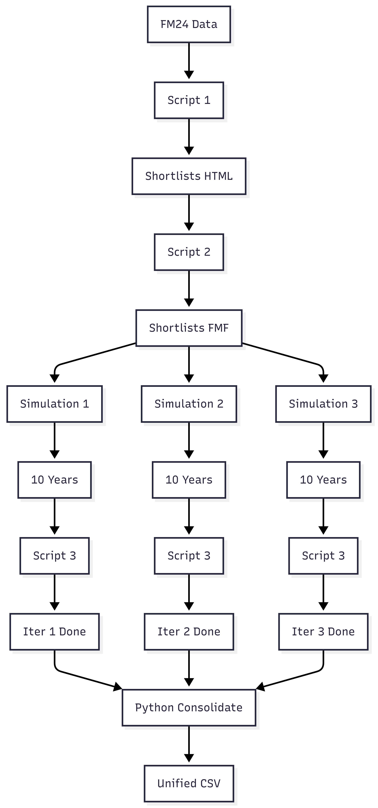
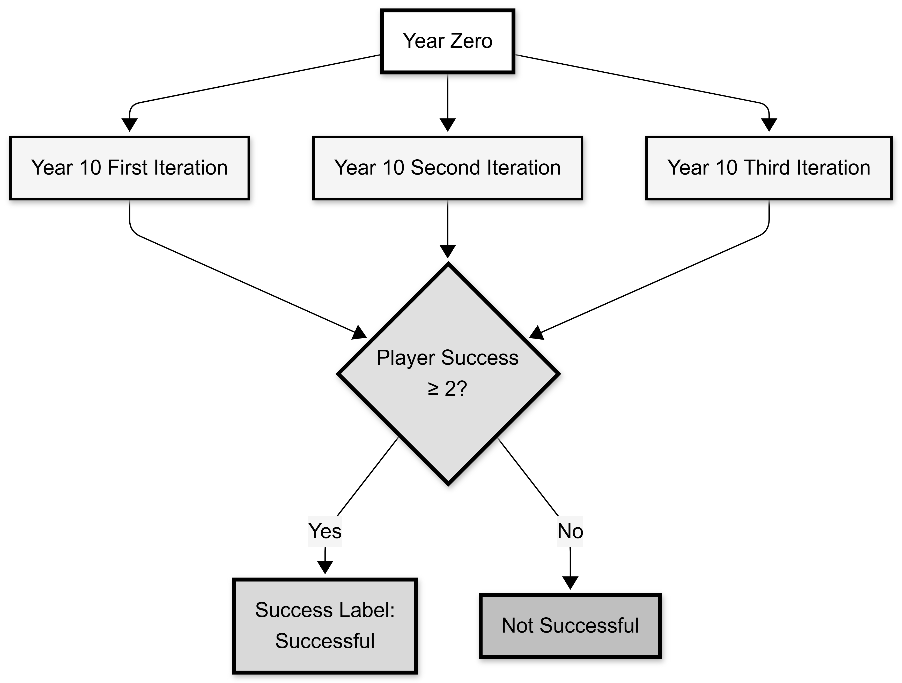
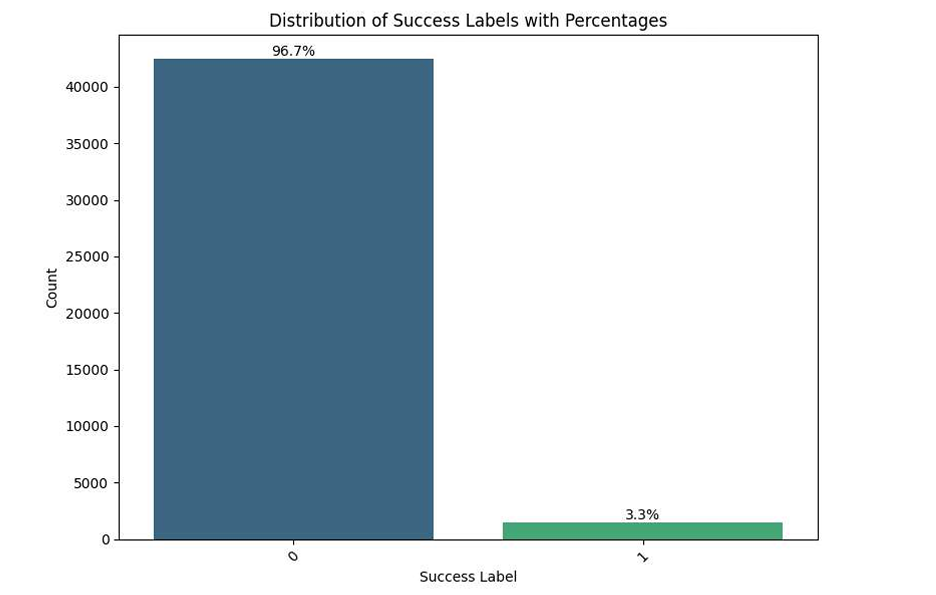
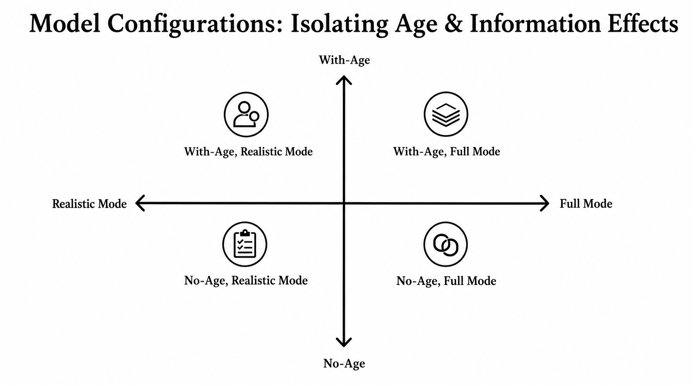
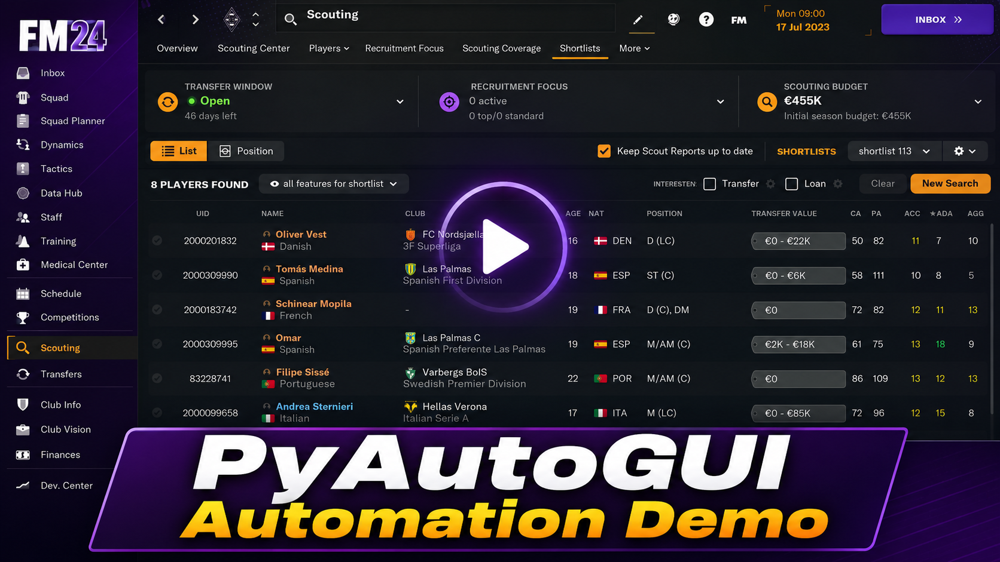
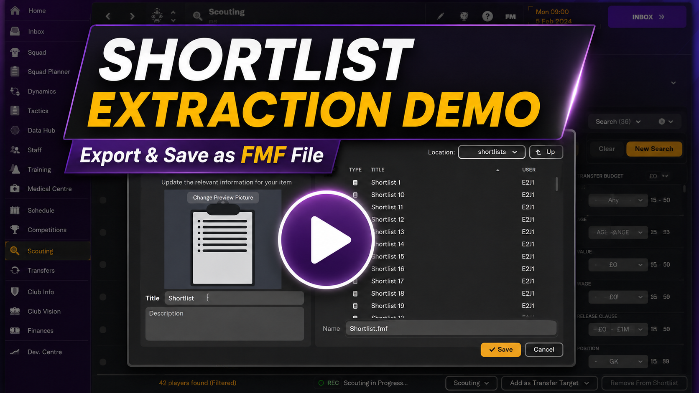
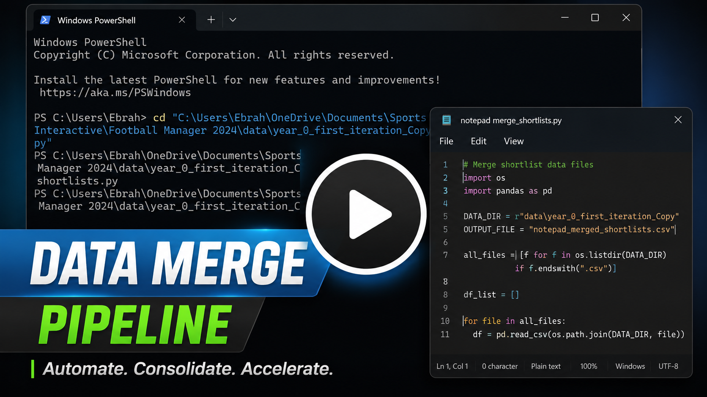
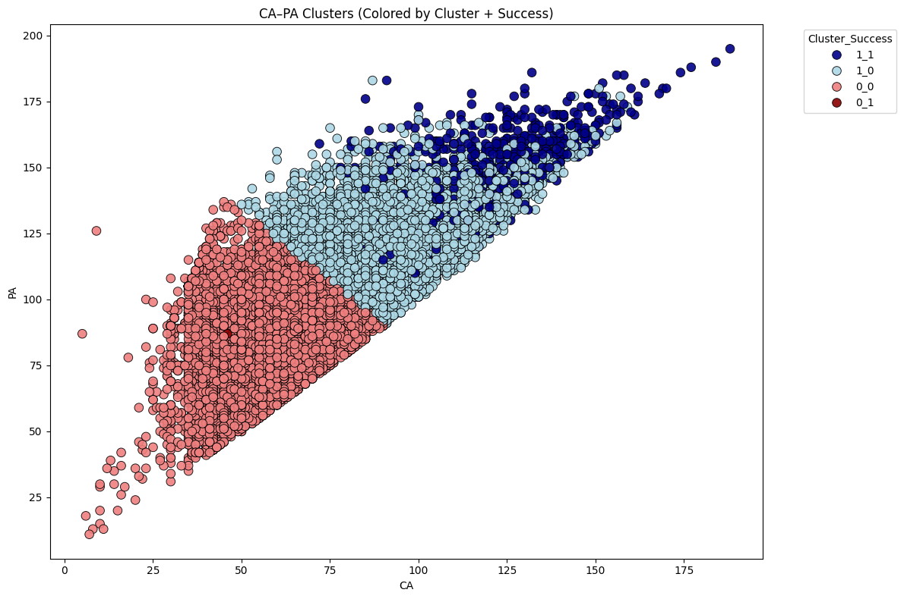
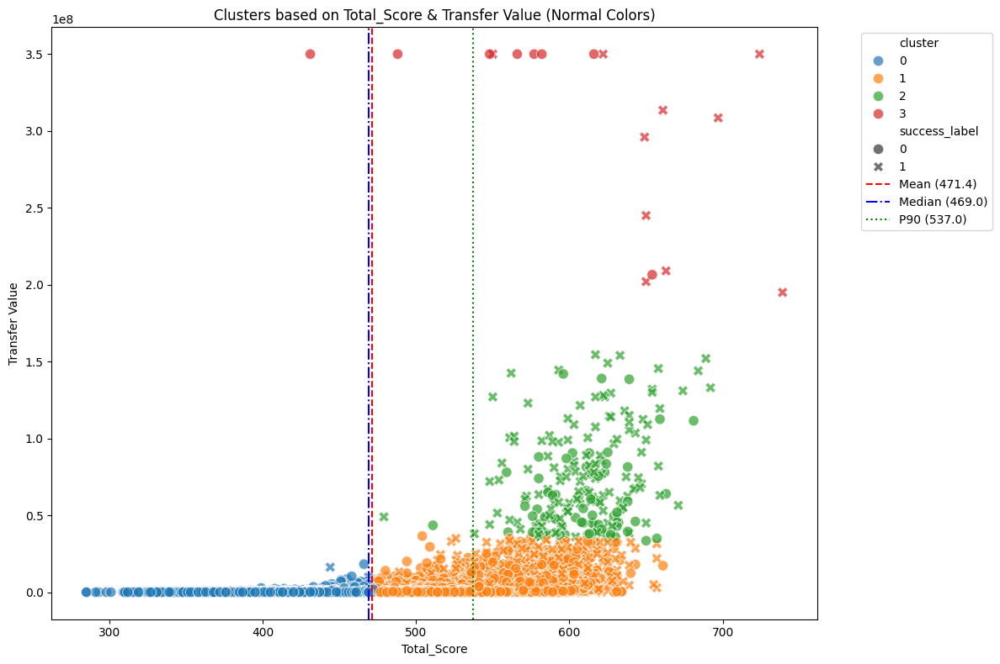

# ⚽ Predicting Football Player Success Using Machine Learning on Football Manager 2024

<p align="center">
  
</p>

<p align="center">
  <b>A research-driven machine learning project that uses Football Manager 2024 as a controlled simulation environment to predict long-term football player success.</b>
</p>

---

## 📌 Project Overview

This project was completed as part of the **Senior Project (STAT 499)** for the **B.Sc. in Statistics and Data Science** program at the **University of Bahrain**.

The project investigates whether early-career football player attributes can be used to predict long-term success after ten simulated seasons in **Football Manager 2024 (FM24)**.

Unlike typical machine learning projects that start from a ready-made CSV file, this project builds a complete research pipeline:

- Automated data extraction from FM24
- Three independent 10-year simulations
- Longitudinal player tracking
- Market-value-based success labeling
- Class imbalance handling
- Predictive modeling
- Interpretability analysis
- Exploratory cluster analysis

---

## 👤 Author

**Ebrahim Juma Shakak Alsawan**  
ID: 202009241  
B.Sc. Statistics and Data Science  
University of Bahrain  

**Supervisor:** Ms. Aseel Masoud Ebrahim Alhermi  
**Department:** Mathematics  
**Date:** December 2025  

---

## 🎯 Research Objective

The main objective of this project is to predict the future success of young football players aged **15–23** using early-career attributes extracted from Football Manager 2024.

The project aims to answer:

> Can machine learning extract reliable patterns from early-career football data to predict long-term player success?

---

## 🧠 Why This Project Is Different

Most student machine learning projects follow a simple workflow:

```text
Dataset → Preprocessing → Model → Evaluation
```

This project follows a full research-engineering workflow:

```text
FM24 Simulation Environment
→ Automated Data Extraction
→ Multi-Year Career Simulation
→ Data Consolidation
→ Success Labeling
→ Machine Learning Modeling
→ Interpretability
→ Cluster Discovery
```

This makes the project not only a predictive modeling task, but also a complete **synthetic longitudinal research framework**.

---

# 🧪 Success Labeling & Experimental Design

## ✅ Success Labeling Framework

Success was not defined using a random threshold.

Instead, the project uses a **dual-benchmark approach**:

1. **Real-world benchmark:** Top 25% market value from Transfermarkt.
2. **FM benchmark:** Mapped to the top 10% of FM Year-10 market values.
3. **Multi-simulation validation:** A player is labeled successful only if they reach the top 10% threshold in at least **2 out of 3 simulations**.

<p align="center">
  
</p>

This ensures that the success label reflects consistent long-term performance rather than a lucky single simulation outcome.

---

## 📊 Success Distribution

Only **3.3%** of players were labeled as successful.

<p align="center">
  
</p>

This creates an extreme class imbalance problem, which makes the prediction task much harder and more realistic.

Because of this imbalance, simple accuracy is not enough. The project uses more appropriate metrics such as:

- Balanced Accuracy
- F1-Score
- Matthews Correlation Coefficient (MCC)
- ROC-AUC
- Precision-Recall analysis

---

## 🔬 Model Configuration Matrix

The study uses a controlled four-way experimental design to isolate the effect of age and hidden attributes.

<p align="center">
  
</p>

The four configurations are:

| Configuration | Description |
|---|---|
| **No-Age + Realistic Mode** | Uses only visible attributes and excludes age |
| **No-Age + Full Mode** | Includes hidden attributes CA/PA but excludes age |
| **With-Age + Realistic Mode** | Uses visible attributes and includes age |
| **With-Age + Full Mode** | Includes visible attributes, hidden attributes, and age |

This design helps answer two important questions:

1. Does age provide genuine predictive value?
2. How much predictive power comes from hidden FM attributes such as CA and PA?

---

# ⚙️ Automated Research Pipeline

A major contribution of this project is the automated data extraction and simulation pipeline.

Football Manager does not provide a simple full-database export tool, so automation was required to collect the dataset at scale.

## 🎥 Demo Videos

> GitHub does not embed MP4 videos directly like YouTube, so each demo is linked through a clickable thumbnail.

---

## 1️⃣ PyAutoGUI Automation Demo

Shows how PyAutoGUI was used to automate the FM24 interface and reduce manual data extraction.

<p align="center">
  <a href="media/1_DEMO_Pyautogui.mp4">
    
  </a>
</p>

---

## 2️⃣ Shortlist Extraction Demo

Shows how player shortlists were generated and exported from FM24 as part of the automated extraction workflow.

<p align="center">
  <a href="media/3_shortlist_extraction.mp4">
    
  </a>
</p>

---

## 3️⃣ Data Merge for Shortlist Pipeline

Shows the data engineering step used to merge, organize, and prepare extracted shortlist files for analysis.

<p align="center">
  <a href="media/2_data_merge_for_the_shortlist.mp4">
    
  </a>
</p>

---

# 📊 Dataset Overview

| Component | Description |
|---|---|
| **Source** | Football Manager 2024 simulation data + Transfermarkt benchmark |
| **Initial Player Pool** | Approximately 88,000 players after league filtering |
| **Final Dataset** | 43,094 players |
| **Age Range** | 15–23 years old |
| **Simulation Length** | 10 in-game years |
| **Simulation Runs** | 3 independent runs |
| **Attributes** | Technical, mental, physical, hidden, demographic, and market-value features |
| **Target Variable** | `success_label` |
| **Positive Class Rate** | Approximately 3.3% successful players |

---

## 🌍 Included Leagues

The dataset was filtered to players from top football leagues, including:

- Argentina
- Belgium
- Brazil
- Croatia
- Denmark
- England
- France
- Germany
- Italy
- Japan
- Mexico
- Netherlands
- Poland
- Portugal
- Spain
- United States

This filtering made the simulation computationally feasible while keeping the player pool competitive and diverse.

---

# 🛠 Methodology

## 1️⃣ Data Collection

Player data was extracted directly from FM24 using an automated PyAutoGUI pipeline.

The process involved:

- Extracting Year-0 player attributes
- Saving players into shortlists
- Exporting HTML files
- Converting shortlists into reusable formats
- Simulating 10 years forward
- Extracting Year-10 player data
- Repeating the process across three independent simulations

---

## 2️⃣ Data Consolidation

The exported HTML files were merged into structured datasets using Python.

The pipeline handled:

- HTML parsing
- Batch merging
- Duplicate removal
- UID-based player matching
- Year-0 and Year-10 alignment
- Simulation run consolidation

---

## 3️⃣ Success Label Creation

A player was labeled successful if:

```text
Player reaches Top 10% Year-10 FM market value
in at least 2 out of 3 independent simulations
```

This majority-vote strategy reduces noise caused by randomness in injuries, transfers, and career development.

---

## 4️⃣ Model Training

The following supervised machine learning models were evaluated:

- Logistic Regression
- Decision Tree
- Random Forest
- Support Vector Classifier
- XGBoost

The project used:

- SMOTE for imbalance handling
- Optuna for hyperparameter optimization
- Train-validation-test split
- Threshold optimization
- Multi-metric evaluation

---

## 5️⃣ Interpretability

Model interpretability was analyzed using:

- SHAP values
- Feature importance
- Coefficient analysis
- Permutation importance

This helped identify which early-career attributes contributed most strongly to long-term success.

---

# 🏆 Key Results

## Best Overall Model

**XGBoost — Full Mode, With Age**

| Metric | Score |
|---|---|
| Balanced Accuracy | **89.99%** |
| F1-Score | **0.465** |
| Precision | **0.164** |
| Recall | **96.77%** |
| ROC-AUC | **0.954** |
| MCC | **0.448** |

This represents the strongest theoretical performance because the model has access to hidden FM attributes such as CA and PA.

---

## Best Realistic Model

**Random Forest — Realistic Mode, With Age**

| Metric | Score |
|---|---|
| Balanced Accuracy | **87.31%** |
| F1-Score | **0.382** |
| Precision | **0.155** |
| Recall | **91.71%** |
| ROC-AUC | **0.923** |
| MCC | **0.376** |

This result is more relevant to real-world scouting because it uses only observable player attributes.

---

# 🔍 Key Findings

## 1️⃣ Hidden Attributes Dominate in Full Mode

When Current Ability (CA) and Potential Ability (PA) are included, they become the strongest predictors of long-term success.

This is expected because they represent internal FM ratings that directly summarize player quality and potential.

---

## 2️⃣ Observable Attributes Still Carry Predictive Signal

Even without hidden attributes, the Realistic Mode models performed strongly.

Important visible predictors included:

### Mental Attributes
- Anticipation
- Decisions
- Determination
- Composure
- Concentration
- Bravery

### Physical Attributes
- Strength
- Balance
- Pace
- Stamina
- Natural Fitness

### Technical Attributes
- First Touch
- Technique
- Passing

---

## 3️⃣ Age Provides Genuine Predictive Value

Age was statistically related to long-term success.

Observed success rates:

| Age Group | Success Rate |
|---|---|
| Young players ≤20 | **1.12%** |
| Peak development group 21–23 | **7.42%** |

With-Age models also improved balanced accuracy by approximately **4–7 percentage points**, confirming that age adds meaningful predictive value.

---

## 4️⃣ Ensemble Models Performed Best

XGBoost and Random Forest consistently outperformed simpler models because they can capture nonlinear interactions between player attributes.

---

## 5️⃣ Player Success Is Predictable but Probabilistic

The project does not claim that machine learning can perfectly predict football careers.

Instead, it shows that FM24 can be used as a controlled environment to identify patterns associated with higher probability of long-term success.

---

# 🧩 Discovery & Latent Structure Analysis

In addition to supervised modeling, the project includes exploratory cluster analysis to investigate whether successful players form natural groups in the data.

---

## CA-PA Cluster Success Visualization

<p align="center">
  
</p>

This visualization shows how players separate in Current Ability and Potential Ability space.

It highlights that success is concentrated in specific regions, especially among players with higher CA and PA values.

---

## Transfer Value Cluster Visualization

<p align="center">
  
</p>

This visualization explores the relationship between player quality, market value, and cluster membership.

It supports the idea that the simulation contains meaningful latent structure rather than random player development patterns.

---

# 📘 Data Dictionary

The project includes a detailed data dictionary covering player attributes, hidden attributes, demographic variables, and simulation outputs.

Attribute groups include:

- Technical attributes
- Mental attributes
- Physical attributes
- Goalkeeping attributes
- Hidden player attributes
- Hidden personality attributes
- Market value variables
- Simulation output variables
- Target labels

---

# 🧰 Technology Stack

## Simulation & Automation
- Football Manager 2024
- PyAutoGUI
- HTML export workflow

## Data Processing
- Python
- pandas
- NumPy
- glob
- HTML parsing

## Machine Learning
- Logistic Regression
- Decision Tree
- Random Forest
- Support Vector Classifier
- XGBoost
- SMOTE
- Optuna

## Model Interpretation
- SHAP
- Permutation Importance
- Feature Importance
- Coefficient Analysis

## Visualization
- Matplotlib
- Seaborn
- PCA
- t-SNE

---

# 📁 Repository Structure

```text
├── media/
│   ├── fm_pipeline_diagram.png
│   ├── majority_vote_framework.png
│   ├── success_distribution.png
│   ├── model_configurations.png
│   ├── demo_pyautogui_thumbnail.png
│   ├── shortlist_extraction_thumbnail.png
│   ├── data_merge_thumbnail.png
│   ├── ca_pa_cluster_success.png
│   ├── transfer_value_clusters.png
│   ├── 1_DEMO_Pyautogui.mp4
│   ├── 3_shortlist_extraction.mp4
│   └── 2_data_merge_for_the_shortlist.mp4
│
├── notebooks/
│   ├── pyautogui.ipynb
│   ├── shortlist script.ipynb
│   ├── year_10_data_extraction_script.ipynb
│   ├── Correlation.ipynb
│   ├── final_LR_With_Age.ipynb
│   ├── final_LR_Without_Age.ipynb
│   ├── final_RF_With_Age.ipynb
│   ├── final_RF_Without_Age.ipynb
│   ├── final_DT_With_Age.ipynb
│   ├── final_DT_Without_Age.ipynb
│   ├── final_SVC_With_Age.ipynb
│   ├── final_SVC_Without_Age.ipynb
│   ├── final_XGBoost_With_Age.ipynb
│   ├── final_XGBoost_Without_Age.ipynb
│   └── final_clusters_Without_Age.ipynb
│
├── STAT 499 FINAL REPORT.pdf
├── presentation.pdf
├── data dictionary.pdf
├── clusters.pdf
├── LICENSE
└── README.md
```

---

# 🚀 Getting Started

## Installation

```bash
pip install pandas numpy scikit-learn xgboost imbalanced-learn
pip install shap optuna matplotlib seaborn pyautogui
```

## Important Note

A legitimate copy of **Football Manager 2024** is required to reproduce the full data extraction and simulation process.

Raw FM database files are not shared due to licensing restrictions.

---

# 🔁 Reproducing the Study

## Step 1: Extract Year-0 Player Data

Use the PyAutoGUI automation scripts to extract player data from FM24.

## Step 2: Generate Shortlists

Players are saved into batches and exported as HTML files.

## Step 3: Run 10-Year Simulations

Simulate ten in-game years from the same Year-0 starting point.

## Step 4: Extract Year-10 Data

Reload the saved shortlists and export updated Year-10 player information.

## Step 5: Repeat Across Three Runs

Repeat the full 10-year simulation process three times to reduce randomness.

## Step 6: Build Success Labels

Apply the majority-vote success labeling rule.

## Step 7: Train and Evaluate Models

Train supervised models under the four experimental configurations.

---

# ⚠️ Limitations

- FM24 is a simulation and cannot fully represent real-world player development.
- Market value is a useful proxy but not a perfect measure of football success.
- Only Year-0 and Year-10 snapshots were collected, with no mid-career tracking.
- Dataset is limited to players aged 15–23 from selected top leagues.
- Hidden FM attributes such as CA and PA are not available to real-world scouts.

---

# 🔮 Future Work

Potential improvements include:

- Extracting Year-1 and Year-5 data for time-series modeling
- Expanding the dataset to lower leagues and broader age groups
- Incorporating contextual variables such as injuries, playing time, coaching quality, and transfers
- Testing deep learning models such as LSTM or Transformer-based approaches
- Validating the framework across other FM versions
- Comparing FM-based predictions with real-world career outcomes

---

# 📄 Full Report

The complete academic report is included in this repository:

```text
STAT 499 FINAL REPORT.pdf
```

It contains:

- Full methodology
- Literature review
- Experimental design
- Model evaluation
- Feature importance analysis
- Statistical validation
- Cluster analysis
- Appendices

---

# 🙏 Acknowledgments

Special thanks to:

- **Ms. Aseel Masoud Ebrahim Alhermi** for her supervision, patience, and continuous guidance.
- **Department of Mathematics, University of Bahrain** for supporting this research project.
- **My family and friends** for their encouragement throughout my university journey.
- **Sports Interactive** for developing Football Manager 2024.
- **Transfermarkt** for providing real-world market value reference data.

---

# 📧 Contact

**Author:** Ebrahim Juma Shakak Alsawan  
**LinkedIn:** [Ebrahim Alsawan](https://www.linkedin.com/in/ebrahim-alsawan-a6977a2b9/)

---

<p align="center">
  <b>Football Manager 2024 as a simulation sandbox for long-term sports analytics research.</b>
</p>
